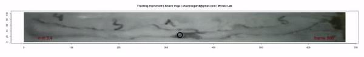

# Trackdem GUI workflow for a single particle

Here I implemented the [trackdem](https://github.com/marjoleinbruijning/trackdem) workflow configured for a single particle in a shiny app that can analyze long videos trough iterating the original workflow of the R package. I tried this software with the video data of the [Wcislo Lab at Smithsonian Tropical Research Institute](https://stri.si.edu/scientist/william-wcislo). It succeeded at tracking bees in experimental nests with some noise that can be filtered out in a following step.

