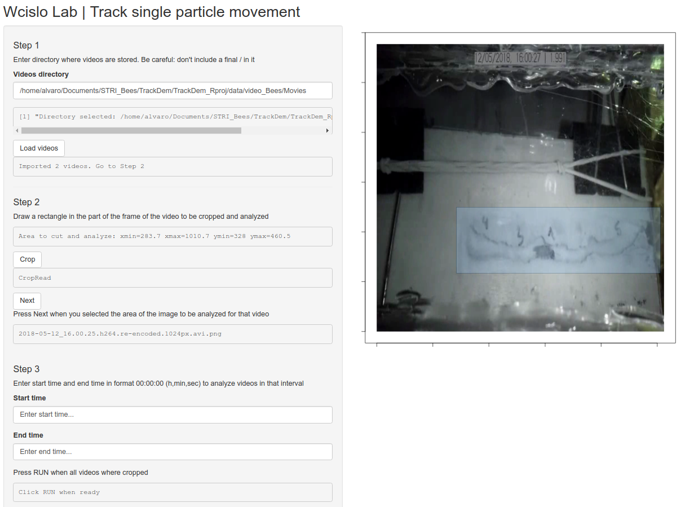

# Trackdem GUI workflow for a single particle

Here I implemented the [trackdem](https://github.com/marjoleinbruijning/trackdem) workflow configured for a single particle in a shiny app that can analyze long videos trough iterating the original workflow in three steps. It can analyze multiple videos, and the user can interactively select the region of the video to be analyzed. This saves resources at running the analyses. Also the user can select the exact time to be analyzed in the videos.

I developed and tested this software for the Megalopta video data of the [Wcislo Lab at Smithsonian Tropical Research Institute](https://stri.si.edu/scientist/william-wcislo). It succeeded at tracking bees in experimental nests with some noise that can be filtered out in a following step.

It was tested in Ubuntu and MacOs.

This is a beta version.

